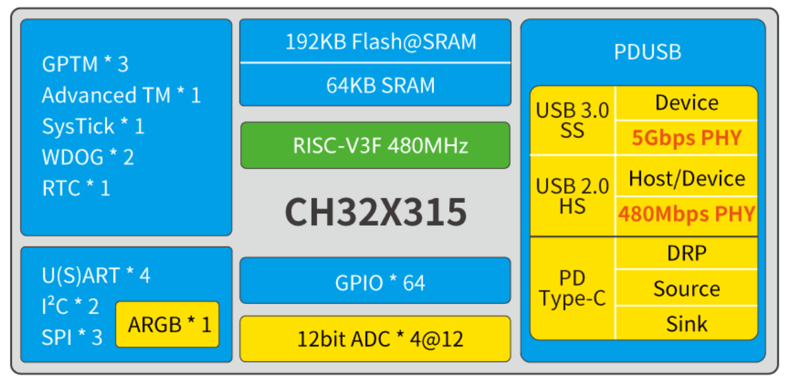

# RISC-V内核工业级多通道ADC微控制器 CH32X315

[EN](README.md) | 中文

### 概述

CH32X315是基于青稞RISC-V内核设计的多通道ADC微控制器，内核支持480MHz零等待运行，支持单精度浮点指令和位操作指令。CH32X315内置了4组高速12位ADC转换单元，提供48个直接输入
通道，支持扫描模式，可搭配模拟开关芯片扩展出8倍数量通道且自动切换；内置USB 3.0超高速控制器和PHY、USB 2.0高速控制器和PHY以及Type-C/PD控制器和PHY，支持USB 3.2 Gen1、USBSS Device
设备功能、USBHS Host主机和USBHS Device设备功能、Type-C和PDUSB快充功能；提供了DMA控制器、ARGB单线RGB驱动、多组定时器、4组USART串口、2组I2C接口、3组SPI等丰富外设资源。
CH32X305在CH32X315的基础上减少了USB 3.0模块。

### 系统框图

### 产品特点

- 青稞32位RISC-V3F内核，多种指令集组合
- 快速可编程中断控制器+硬件中断堆栈
- 2级中断嵌套
- 支持单精度浮点指令、位操作指令
- 内核最高频率480MHz，系统最高频率313MHz
- 性能模式下内核支持625MHz，系统支持400MHz

- 64KB易失数据存储区SRAM
- 480KB程序存储区CodeFlash
（192KB零等待应用区+288KB非零等待数据区）
- 28KB系统引导程序存储区BootLoader
- 128B用户自定义信息存储区

- 系统供电VDD范围：2.8～3.6V
- 低功耗模式：睡眠、停止

- 内置出厂调校的20MHz的RC振荡器
- 内置约40kHz的RC振荡器
- 高速振荡器支持外部5～32MHz晶体
- 上/下电复位、可编程电压监测器

- 1个16位高级定时器，支持死区控制和紧急刹
车，提供用于电机控制的PWM互补输出
- 2个16位和1个32位通用定时器，提供输入捕
获/输出比较/PWM/脉冲计数及增量编码器输入
- 2个看门狗定时器（独立和窗口型）
- 系统时基定时器：32位计数器

- 实时时钟RTC：32位独立定时器

- 11个DMA通道，支持环形缓冲区管理

- 4组12位模数转换ADC：
- 模拟输入范围：VREF-～VREF+
- 4*12=48个外部信号+1个内部信号通道
- 采样速率高达5Msps，支持多ADC转换模式
- 支持扫描模式，支持外部扩展自动切换
- 支持提前切换通道，方便信号稳定采样
- 支持4组ADC级联，等效20Msps采样率

- 4组USART串口：支持LIN

- 2组I2C接口

- 3组SPI接口

- 5Gbps超高速USB 3.0控制器及PHY
- 支持超高速的Device模式
- 高速一体化设计，实测每秒450Mbytes

- 480Mbps高速USB 2.0控制器及PHY：
- 支持高速/全速的Host和Device模式
- 支持1024字节数据包

- USB PD和Type-C控制器及PHY：
- 支持DRP、Sink和Source应用，支持PDUSB
- 支持PD3.2和EPR，支持100W或240W快充

- 可级联可寻址单线RGB（ARGB）

- 快速GPIO端口：
- 64个I/O口，映射16个外部中断

- CRC计算单元，96位芯片唯一ID

- 支持单线和双线两种调试模式

- 封装形式：LQFP、QFN